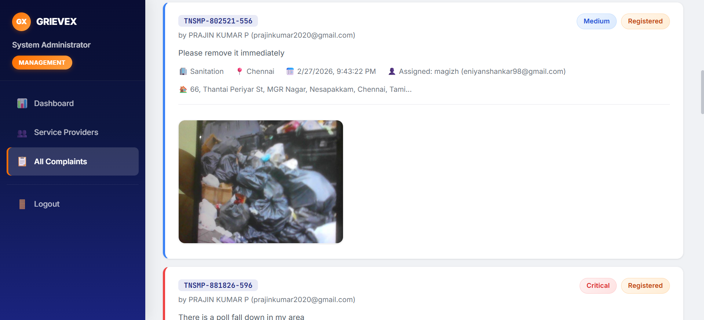
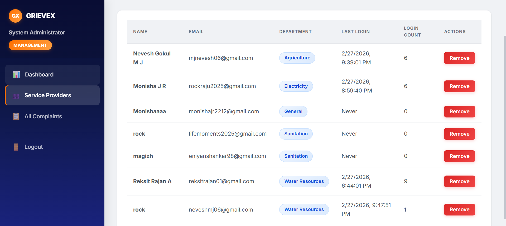
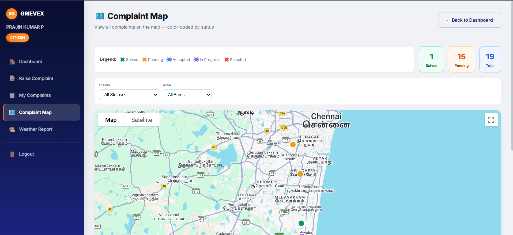
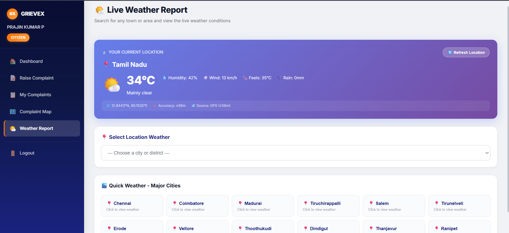
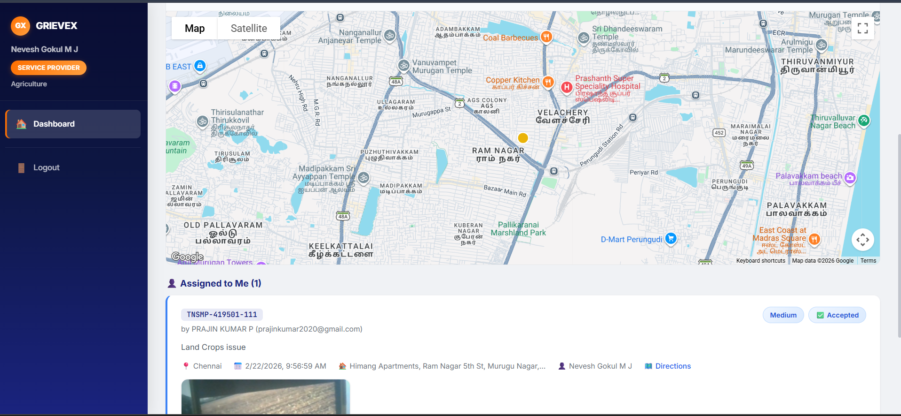

# Round 2 — GRIEVEX: AI-Powered Civic Grievance Management Platform

> Raise your concern. We handle the rest.

**GRIEVEX** is a full-stack, AI-integrated civic grievance platform built for Tamil Nadu citizens to report, track, and resolve public service issues — powered by **Google Cloud Vision API**, **DeepSeek LLM via OpenRouter**, **GPS-based geolocation**, **real-time weather intelligence**, and a **role-based multi-dashboard architecture**.

---

## Live Demo

| Service | URL |
|---|---|
| Frontend (Vercel) | https://vit-chi.vercel.app |

---

## Demo Credentials

| Role | Email | Password |
|---|---|---|
| **User** | prajinkumar2020@gmail.com | Prajin@123 |
| **Admin / Management** | admin@tnsmp.gov.in | admin@tnsmp2026 |

> Credentials are pre-filled on the login page — one click to access.

---

## Table of Contents

1. [Overview](#overview)
2. [Feature 1 — Smart Complaint GeoMap](#feature-1--smart-complaint-geomap-)
3. [Feature 2 — Disaster Weather Intelligence](#feature-2--disaster-weather-intelligence-)
4. [Feature 3 — StateWise Civic Analytics Dashboard](#feature-3--statewise-civic-analytics-dashboard-)
5. [Feature 4 — Admin Intelligence Control Panel](#feature-4--admin-intelligence-control-panel-)
6. [Feature 5 — Smart Job Allocation Engine](#feature-5--smart-job-allocation-engine-)
7. [AI & ML Core](#ai--ml-core)
8. [Tech Stack](#tech-stack)
9. [Roles & Access Control](#roles--access-control)
10. [Installation](#installation)
11. [Environment Variables](#environment-variables)
12. [Project Structure](#project-structure)

---

## Overview

GRIEVEX bridges the gap between Tamil Nadu citizens and government service providers by digitising and automating the entire grievance lifecycle — from submission and AI-based classification, to prioritisation, assignment, resolution, and feedback.

Instead of citizens calling helplines or physically visiting offices, GRIEVEX provides a transparent, real-time, AI-driven platform where every complaint is tracked, prioritised, and resolved efficiently.

---

## Feature Summary

| # | Feature Name | Core Technology |
|---|---|---|
| 1 | Smart Complaint GeoMap | GPS + Google Maps Geocoding + Interactive Map |
| 2 | Disaster Weather Intelligence | Open-Meteo API + GPS + Weather WMO Codes |
| 3 | StateWise Civic Analytics Dashboard | MongoDB Aggregation + Real-time Charts |
| 4 | Admin Intelligence Control Panel | Role-Based Analytics + Provider Metrics |
| 5 | Smart Job Allocation Engine | AI Priority Queue + Department Routing |

---

## Screenshots

<table>
  <tr>
    <td align="center"></td>
    <td align="center"></td>
  </tr>
  <tr>
    <td align="center"></td>
    <td align="center"></td>
  </tr>
  <tr>
    <td align="center"></td>
    <td></td>
  </tr>
</table>

---

## Feature 1 — Smart Complaint GeoMap 🌍

### What It Is

The **Smart Complaint GeoMap** visually displays all reported civic complaints on an interactive map. Every complaint submitted with GPS location data is plotted as a pin, colour-coded by department and priority. Citizens and administrators can instantly see complaint **clusters and problem hotspots** across Tamil Nadu.

### How It Works

- When a user raises a complaint, the app captures **live GPS coordinates** via `navigator.geolocation.watchPosition` (high accuracy mode).
- Coordinates are sent to the **Google Maps Geocoding API** for reverse geocoding into human-readable district/area names.
- On the Complaint Map page, all public complaints are fetched and rendered as map markers with popup info (department, status, priority, description).
- Users can filter by department, area, or status directly on the map.

### Advantages

| Advantage | Impact |
|---|---|
| Identify high-risk hotspot areas | Faster infrastructure repair planning |
| Real-time complaint visualisation | Citizens and officials see the same live data |
| Location-based clustering | Prioritise areas with multiple complaints |
| Transparent mapping | Builds public trust in the platform |
| GPS accuracy | Eliminates incorrect area reports |

---

## Feature 2 — Disaster Weather Intelligence 🌦️

### What It Is

**Disaster Weather Intelligence** integrates real-time weather data with the complaint management system. It provides current weather conditions for all **37 Tamil Nadu districts**, helping correlate weather events (floods, storms, heatwaves) with the types of complaints being reported.

### How It Works

- Users access the Weather Report page from their dashboard.
- The app first requests **GPS location** to auto-detect the user's city.
- Weather data is fetched from the **Open-Meteo API** (free, no API key) using WMO weather codes mapped to descriptive conditions.
- Data shown: Temperature, Wind Speed, Humidity, Precipitation, UV Index, Weather Condition with emoji and description.
- Users can also manually select from all 37 Tamil Nadu district cities.
- The system maps **37 Tamil Nadu cities with lat/lng coordinates** for precise weather fetching.

### Why It Matters for Disaster Response

- Flood alerts → correlate with **Water Resources** complaint spikes
- Storm warnings → predict surge in **Roads & Highways** and **Electricity** complaints
- Helps authorities **pre-position teams** before complaints arrive en masse

### Advantages

| Advantage | Impact |
|---|---|
| Real-time weather awareness | Informed decision making |
| District-level granularity | Hyper-local weather for TN's 37 districts |
| Complaint-weather correlation | Predictive disaster response |
| GPS auto-location | No manual city selection needed |
| Zero API cost | Built on Open-Meteo's free tier |

---

## Feature 3 — StateWise Civic Analytics Dashboard 📊

### What It Is

**StateWise Civic Analytics** provides state-level statistical insights combining all complaints across Tamil Nadu's 37 districts. It shows complaint distribution, resolution rates, department breakdown, and area-wise trends — all in real time.

### How It Works

- The Management Dashboard aggregates all complaint data from MongoDB using indexed queries.
- KPI cards show: Total Complaints, Resolved, Pending, Critical priority count.
- Department-wise breakdown shows which civic sector has the most unresolved issues.
- Area/district filter shows all complaints for a specific region.
- Admins can drill down by status, department, and date.
- All data updates live without page reload.

### Advantages

| Advantage | Impact |
|---|---|
| State-level analytics | Birds-eye view of all civic issues |
| Department breakdown | Identify under-performing departments |
| District-wise filtering | Region-specific planning |
| Real-time data | Always current, no stale reports |
| Data-driven governance | Supports evidence-based policy making |

---

## Feature 4 — Admin Intelligence Control Panel 🧠

### What It Is

The **Admin Intelligence Control Panel** is a comprehensive management dashboard giving administrators **full visibility and control** over the entire platform — users, service providers, complaints, assignments, and resolution performance.

### What It Shows

| Panel | Data Points |
|---|---|
| KPI Overview | Total complaints, resolved, pending, critical count |
| Complaint Table | All complaints with full detail, filtering, search |
| Assignment Engine | Assign complaint → provider with one click |
| Provider Panel | All provider accounts, department, workload |
| AI Remarks | AI-generated analysis for every complaint |
| Status Override | Admins can override complaint status at any stage |

### How It Works

- Role-based auth ensures only `management` role users can access these routes.
- The dashboard calls `/api/management/dashboard` which returns aggregated MongoDB stats.
- The complaints table supports filter by status, department, area, and priority.
- Provider management allows creating, viewing, and deleting provider accounts.
- All data is fetched with JWT authentication and real-time.

### Advantages

| Advantage | Impact |
|---|---|
| Full system visibility | Nothing is missed by administrators |
| Service provider tracking | Measure individual provider performance |
| Complaint assignment | Efficient delegation, no bottlenecks |
| AI remarks visible | AI decisions are transparent and auditable |
| One unified panel | No switching between multiple tools |

---

## Feature 5 — Smart Job Allocation Engine ⚙️

### What It Is

The **Smart Job Allocation Engine** is an AI-powered priority queue system that automatically classifies, ranks, and routes complaints to the correct government department and service provider — based on image analysis, text understanding, and urgency scoring.

### How It Works — End-to-End Pipeline

```
User submits complaint (photo + description + GPS)
          │
          ▼
┌─────────────────────────────────┐
│  Google Cloud Vision API        │
│  Analyses photo → detects       │
│  labels, objects, text          │
│  → maps to department keywords  │
└──────────────┬──────────────────┘
               │  (fallback if Vision fails)
               ▼
┌─────────────────────────────────┐
│  OpenRouter DeepSeek LLM        │
│  Reads description + photo      │
│  → Outputs department + priority│
│  → Detects duplicate/fake       │
└──────────────┬──────────────────┘
               │
               ▼
┌─────────────────────────────────┐
│  Priority Assignment            │
│  Critical / High / Medium / Low │
│  Based on: severity, location,  │
│  disaster conditions, LLM score │
└──────────────┬──────────────────┘
               │
               ▼
┌─────────────────────────────────┐
│  Admin assigns to Provider      │
│  Provider sees sorted queue     │
│  Critical → top of queue        │
└─────────────────────────────────┘
```

### AI Capabilities

| Capability | Technology | Fallback |
|---|---|---|
| Image → Department | Google Cloud Vision API | Keyword NLP (offline) |
| Text → Department | DeepSeek LLM via OpenRouter | Keyword NLP (offline) |
| Priority scoring | DeepSeek LLM | Rule-based scoring |
| Duplicate detection | AI similarity analysis | None |
| Fake complaint detection | LLM content analysis | None |
| Department routing | Weighted keyword mapping | Always available |

### Priority Queue Logic

Complaints are ranked by priority level before display in provider dashboards:

```
1. 🔴 Critical  — Immediate threat (flood, power outage, road collapse)
2. 🟠 High      — Urgent issue affecting many people
3. 🟡 Medium    — Significant but non-emergency issue
4. 🟢 Low       — Minor inconvenience or routine maintenance
```

### Advantages

| Advantage | Impact |
|---|---|
| AI auto-classification | Zero manual triage needed |
| Priority queue ranking | Critical issues solved first |
| Duplicate filtering | Avoids duplicate work |
| Fake complaint detection | Reduces spam and misuse |
| Offline fallback NLP | System never breaks, always classifies |
| GPS-based routing | Complaints go to correct district teams |

---

## AI & ML Core

### Google Cloud Vision API
Analyses each complaint photo to detect labels, objects, and text. Labels are matched against a weighted keyword dictionary for 10 departments. The department with the highest keyword-match score is selected.

### DeepSeek v3 LLM (via OpenRouter)
Processes the complaint text description and returns structured JSON with: department, priority level, duplicate detection flag, and reasoning.

### Offline NLP Fallback
A comprehensive keyword dictionary for all 10 departments (Water, Electricity, Roads, Sanitation, Health, Education, Transport, Revenue, Agriculture, General) ensures the system always functions even when cloud AI is unavailable.

### Amazon-Style Status Timeline
Every complaint tracks a full history — `Registered → Accepted → Working On → Completed / Rejected` — with timestamps, provider names, and resolution notes at each stage.

---

## Tech Stack

| Layer | Technology |
|---|---|
| Frontend | React.js, React Router DOM, Axios |
| Styling | Custom CSS Design System (App.css) |
| Camera | react-webcam (in-browser live capture) |
| Weather | Open-Meteo API (free, no key required) |
| Geocoding | Google Maps Geocoding API |
| Backend | Node.js, Express.js |
| Database | MongoDB + Mongoose (indexed collections) |
| Auth | JWT + bcryptjs |
| Email | Nodemailer + Gmail SMTP (OTP + notifications) |
| AI Vision | Google Cloud Vision API |
| AI Text | OpenRouter API (DeepSeek Chat v3) |
| Deployment | Vercel (Frontend) |

---

## Roles & Access Control

| Role | Access |
|---|---|
| `user` | Raise complaints, track status, view map, weather, rate completed complaints |
| `provider` | View assigned complaints, update status, add resolution notes |
| `management` | Full admin panel, analytics, assignment engine, provider management |

All routes are protected with JWT middleware. Role mismatches return 403.

---

## Installation

```bash
# Clone the repo
git clone https://github.com/NeveshMJ/vit.git
cd vit

# Backend
cd backend
npm install
# Add .env file (see below)
node server.js

# Frontend
cd ../frontend
npm install
npm start
```

---

## Environment Variables

Create `backend/.env`:

```env
PORT=5000
MONGODB_URI=mongodb+srv://<user>:<password>@cluster.mongodb.net/grievex
JWT_SECRET=your_jwt_secret

EMAIL_USER=your_gmail@gmail.com
EMAIL_PASS=your_gmail_app_password

OPENROUTER_API_KEY=sk-or-v1-...
GOOGLE_CREDENTIALS={"type":"service_account","project_id":"..."}
GOOGLE_MAPS_API_KEY=AIza...
```

---

## Project Structure

```
grievex/
├── backend/
│   ├── server.js
│   ├── middleware/auth.js
│   ├── models/
│   │   ├── User.js
│   │   └── Complaint.js
│   ├── routes/
│   │   ├── auth.js
│   │   ├── complaints.js
│   │   ├── management.js
│   │   └── provider.js
│   └── utils/
│       ├── gemini.js       ← DeepSeek LLM integration
│       ├── vision.js       ← Google Vision + fallback NLP
│       └── mailer.js       ← OTP + email notifications
├── frontend/src/
│   ├── pages/
│   │   ├── LandingPage.js
│   │   ├── Login.js
│   │   ├── Signup.js
│   │   ├── VerifyOTP.js
│   │   ├── user/
│   │   │   ├── UserDashboard.js
│   │   │   ├── RaiseComplaint.js   ← Webcam + GPS + AI
│   │   │   ├── MyComplaints.js
│   │   │   ├── ComplaintMap.js     ← Feature 1: GeoMap
│   │   │   └── WeatherReport.js    ← Feature 2: Weather Intelligence
│   │   ├── provider/
│   │   │   └── ProviderDashboard.js
│   │   └── management/
│   │       ├── ManagementDashboard.js   ← Feature 3 & 4
│   │       ├── ManagementComplaints.js
│   │       └── ManageProviders.js
│   └── components/Sidebar.js
└── vercel.json
```

---

## License

MIT License — Open for educational and hackathon use.

---

*Built for Tamil Nadu. Powered by AI. Designed for citizens.*


GRIEVEX is a full-stack, AI-integrated civic grievance platform built for Tamil Nadu citizens to report, track, and resolve public service issues — powered by Google Cloud Vision, DeepSeek LLM via OpenRouter, GPS-based geolocation, real-time weather intelligence, and a role-based multi-dashboard architecture.

---

## Live Demo

| Service | URL |
|---|---|
| Frontend (Vercel) | https://vit-chi.vercel.app |
| Backend (Render / Railway) | `https://your-backend-url.com` |

---

## Demo Credentials

| Role | Email | Password |
|---|---|---|
| **User** | prajinkumar2020@gmail.com | Prajin@123 |
| **Admin / Management** | admin@tnsmp.gov.in | admin@tnsmp2026 |

> These are pre-filled on the login page for easy judge access.

---

## Table of Contents

- [Overview](#overview)
- [Features](#features)
- [Tech Stack](#tech-stack)
- [Architecture](#architecture)
- [Roles & Dashboards](#roles--dashboards)
- [AI & ML Integration](#ai--ml-integration)
- [API Reference](#api-reference)
- [Database Schema](#database-schema)
- [Installation](#installation)
- [Environment Variables](#environment-variables)
- [Project Structure](#project-structure)

---

## Overview

GRIEVEX bridges the gap between citizens and government service providers by digitalising and automating the entire grievance lifecycle — from complaint submission to final resolution. Citizens can capture real-time photos, describe issues, and let the AI automatically classify the department, detect priority, and flag duplicates — eliminating manual triage entirely.

---

## Features

### For Citizens (User Role)

| Feature | Description |
|---|---|
| **Raise Complaint** | Submit complaints with live webcam photo + GPS location + AI auto-classification |
| **AI Department Detection** | Google Vision API + keyword mapping auto-selects the correct department from the photo |
| **AI Priority Detection** | DeepSeek LLM analyses the description and assigns Critical / High / Medium / Low priority |
| **Duplicate Detection** | AI flags if the complaint is a duplicate of an existing one in the same area/department |
| **Fake Detection** | AI identifies nonsensical or spam complaints before submission |
| **GPS Auto-Location** | Live GPS tracking captures coordinates; Google Maps Geocoding API reverse-geocodes to area name |
| **Manual Override** | Users can override both the AI-detected department and the GPS-detected area |
| **My Complaints** | View all submitted complaints with full Amazon-style status timeline |
| **Status Timeline** | Each complaint shows: Registered → Accepted → Working On → Completed / Rejected |
| **Complaint Map** | Interactive map view of all public complaints plotted by GPS coordinates |
| **Weather Report** | Real-time weather for all 37 Tamil Nadu districts using Open-Meteo API + GPS |
| **Rating & Feedback** | Rate completed complaints (1–5 stars) and leave written feedback |

---

### For Service Providers (Provider Role)

| Feature | Description |
|---|---|
| **Provider Dashboard** | View all complaints assigned to their department |
| **Status Management** | Update complaint status (Accepted → Working On → Completed / Rejected) |
| **Add Resolution Notes** | Attach resolution descriptions when closing complaints |
| **Department Filter** | Complaints pre-filtered to their assigned department |

---

### For Management / Admin (Management Role)

| Feature | Description |
|---|---|
| **Management Dashboard** | System-wide analytics: total complaints, resolution rates, department breakdowns |
| **All Complaints View** | View, filter, and search every complaint in the system |
| **Complaint Assignment** | Assign complaints to specific service providers |
| **Provider Management** | Create, view, and manage provider accounts and department assignments |
| **Priority Escalation** | Override AI priority for critical issues |
| **AI Remarks** | View AI analysis remarks for every complaint |

---

### Platform-Wide

| Feature | Description |
|---|---|
| **OTP Email Verification** | New users must verify email via 6-digit OTP before accessing the platform |
| **JWT Authentication** | Stateless, secure token-based auth for all API calls |
| **Role-Based Access Control** | Routes and API endpoints are gated by role (user / provider / management) |
| **Responsive UI** | Fully responsive across desktop, tablet, and mobile |
| **Animated Landing Page** | Single-frame hero with GRIEVEX branding, stat pills, and CTAs |
| **Credential Quick-Fill** | Demo credential panel on login for judges — one-click auto-fill |

---

## Tech Stack

### Frontend
| Technology | Purpose |
|---|---|
| React.js | UI framework (Create React App) |
| React Router DOM | Client-side routing with protected routes |
| Axios | HTTP requests to backend API |
| react-webcam | Live camera capture in-browser |
| Open-Meteo API | Free weather data (no API key required) |
| Google Maps Geocoding API | Reverse geocode GPS → readable address |

### Backend
| Technology | Purpose |
|---|---|
| Node.js + Express.js | REST API server |
| MongoDB + Mongoose | Database with indexed schemas |
| JWT (jsonwebtoken) | Stateless authentication |
| bcryptjs | Password hashing |
| Nodemailer + Gmail | OTP and status notification emails |
| Multer | File/image handling |
| dotenv | Environment variable management |

### AI / ML
| Technology | Purpose |
|---|---|
| Google Cloud Vision API | Image label detection → department classification |
| OpenRouter (DeepSeek v3) | LLM for text-based department + priority detection, duplicate/fake analysis |
| Custom keyword mapping | Offline fallback when cloud AI is unavailable |

---

## Architecture

```
┌─────────────────────────────────────────────────────────────┐
│                     GRIEVEX Frontend (React)                │
│  LandingPage → Login/Signup → OTP Verify                   │
│  ├── User: Dashboard, RaiseComplaint, MyComplaints,        │
│  │         ComplaintMap, WeatherReport                      │
│  ├── Provider: ProviderDashboard                           │
│  └── Management: Dashboard, Complaints, ManageProviders    │
└─────────────────────────┬───────────────────────────────────┘
                          │ REST API (Axios)
┌─────────────────────────▼───────────────────────────────────┐
│                   Express.js Backend                        │
│  /api/auth      → Register, Login, OTP Verify              │
│  /api/complaints → CRUD, AI analysis, public feed          │
│  /api/provider  → Provider-scoped complaint management      │
│  /api/management → Admin dashboard, provider management     │
└────────┬─────────────────────────────────────┬──────────────┘
         │                                     │
┌────────▼────────┐                  ┌─────────▼──────────────┐
│    MongoDB       │                  │    External APIs        │
│  Users          │                  │  Google Cloud Vision    │
│  Complaints     │                  │  OpenRouter / DeepSeek  │
│  (Indexed)      │                  │  Google Maps Geocoding  │
└─────────────────┘                  │  Open-Meteo Weather     │
                                     │  Nodemailer / Gmail     │
                                     └────────────────────────┘
```

---

## Roles & Dashboards

### User Dashboard
- Stats cards: Registered, In Progress, Completed complaints
- Quick action buttons: Raise Complaint, View Map, Weather
- Live feed of all public complaints with area/department/status filters
- Personal complaints timeline

### Provider Dashboard
- Department-specific complaint queue
- One-click status update workflow
- Resolution note submission

### Management Dashboard
- KPI cards: Total, Resolved, Pending, Critical complaints
- Department-wise performance breakdown
- Full complaint table with assignment capability
- Provider accounts management

---

## AI & ML Integration

### 1. Image-Based Department Classification (Google Cloud Vision)
When a user captures a photo, the backend sends it to Google Cloud Vision API. Returned labels are matched against a weighted keyword dictionary for 10 departments (Water Resources, Electricity, Roads & Highways, Sanitation, Public Health, Education, Transport, Revenue, Agriculture, General). The highest-scoring department is auto-selected.

### 2. LLM-Based Classification + Priority (DeepSeek via OpenRouter)
The complaint description is sent to the DeepSeek Chat v3 model via OpenRouter API. The LLM returns:
- **Department** — most appropriate government department
- **Priority** — Critical / High / Medium / Low with justification
- **Duplicate flag** — whether similar complaints exist
- **Fake flag** — whether the complaint appears to be spam or nonsense

### 3. Offline Fallback
If cloud APIs are unavailable (quota exceeded, network issues), the system automatically falls back to a local keyword-matching NLP engine so submissions are never blocked.

### 4. GPS + Reverse Geocoding
Live `watchPosition` tracks the user's GPS while the camera is open. The coordinates captured at photo-snap time are sent to the Google Maps Geocoding API to produce a human-readable address and auto-detect the Tamil Nadu district/area.

---

## API Reference

### Auth Routes `/api/auth`
| Method | Endpoint | Description | Auth |
|---|---|---|---|
| POST | `/register` | Register new user, send OTP | Public |
| POST | `/verify-otp` | Verify OTP, activate account | Public |
| POST | `/login` | Login, returns JWT token | Public |

### Complaint Routes `/api/complaints`
| Method | Endpoint | Description | Auth |
|---|---|---|---|
| POST | `/submit` | Submit complaint with photo + GPS | User |
| GET | `/my` | Get current user's complaints | User |
| GET | `/all-public` | Get all public complaints (filterable) | User |
| GET | `/:id` | Get complaint detail + timeline | Auth |
| POST | `/:id/rate` | Submit rating & feedback | User |
| PATCH | `/:id/status` | Update complaint status | Provider / Mgmt |

### Management Routes `/api/management`
| Method | Endpoint | Description | Auth |
|---|---|---|---|
| GET | `/dashboard` | System-wide analytics | Management |
| GET | `/complaints` | All complaints with filters | Management |
| PATCH | `/complaints/:id/assign` | Assign complaint to provider | Management |
| GET | `/providers` | List all provider accounts | Management |
| POST | `/providers` | Create a provider account | Management |
| DELETE | `/providers/:id` | Remove provider | Management |

### Provider Routes `/api/provider`
| Method | Endpoint | Description | Auth |
|---|---|---|---|
| GET | `/complaints` | Get assigned department complaints | Provider |
| PATCH | `/complaints/:id/status` | Update status + resolution | Provider |

---

## Database Schema

### User
```js
{
  name: String,
  email: String (unique),
  password: String (bcrypt hashed),
  phone: String,
  isVerified: Boolean,
  otp: String,
  otpExpiry: Date,
  role: 'user' | 'provider' | 'management',
  department: String,       // only for providers
  loginCount: Number,
  lastLogin: Date
}
```

### Complaint
```js
{
  ticketId: String,          // e.g. GRX-2026-00042
  userId, userName, userEmail,
  area: String,              // Tamil Nadu district
  address: String,           // full reverse-geocoded address
  department: String,        // one of 10 departments
  description: String,
  photo: String,             // base64 image
  status: 'Registered' | 'Accepted' | 'Working On' | 'Completed' | 'Rejected',
  statusHistory: [{ status, timestamp, updatedBy, note }],
  priority: 'Critical' | 'High' | 'Medium' | 'Low',
  assignedTo, assignedToName,
  location: { latitude, longitude },
  rating: Number (1-5),
  feedback: String,
  isDuplicate: Boolean,
  duplicateOf: String,
  isFake: Boolean,
  aiRemarks: String
}
```

---

## Installation

### Prerequisites
- Node.js v18+
- MongoDB (local or Atlas)
- Google Cloud Vision API key
- OpenRouter API key
- Gmail account (for Nodemailer)

### Clone & Setup

```bash
git clone https://github.com/NeveshMJ/vit.git
cd vit
```

### Backend

```bash
cd backend
npm install
# Create .env file (see Environment Variables section)
node server.js
```

### Frontend

```bash
cd frontend
npm install
npm start
```

---

## Environment Variables

Create `backend/.env`:

```env
PORT=5000
MONGODB_URI=mongodb+srv://<user>:<password>@cluster.mongodb.net/grievex
JWT_SECRET=your_jwt_secret_here

# Email (Nodemailer)
EMAIL_USER=your_gmail@gmail.com
EMAIL_PASS=your_gmail_app_password

# AI APIs
OPENROUTER_API_KEY=sk-or-v1-...
GOOGLE_CREDENTIALS={"type":"service_account","project_id":"..."}
GOOGLE_MAPS_API_KEY=AIza...
```

> **Never commit `.env` to git.** It is already in `.gitignore`.

---

## Project Structure

```
grievex/
├── backend/
│   ├── server.js               # Express app entry point
│   ├── middleware/
│   │   └── auth.js             # JWT verification middleware
│   ├── models/
│   │   ├── User.js             # User schema
│   │   └── Complaint.js        # Complaint schema (full lifecycle)
│   ├── routes/
│   │   ├── auth.js             # Register, Login, OTP
│   │   ├── complaints.js       # Submit, fetch, rate complaints
│   │   ├── management.js       # Admin routes
│   │   └── provider.js         # Provider routes
│   └── utils/
│       ├── gemini.js           # OpenRouter / DeepSeek LLM integration
│       ├── vision.js           # Google Cloud Vision + fallback NLP
│       └── mailer.js           # Nodemailer OTP + notification emails
├── frontend/
│   ├── public/
│   │   └── index.html
│   └── src/
│       ├── App.js              # Routes + protected route logic
│       ├── App.css             # Design system + all styles
│       ├── api.js              # Axios instance with JWT interceptor
│       ├── components/
│       │   └── Sidebar.js      # Role-aware navigation sidebar
│       └── pages/
│           ├── LandingPage.js
│           ├── Login.js        # Login + demo credential panel
│           ├── Signup.js
│           ├── VerifyOTP.js
│           ├── user/
│           │   ├── UserDashboard.js
│           │   ├── RaiseComplaint.js   # Webcam + GPS + AI analysis
│           │   ├── MyComplaints.js
│           │   ├── ComplaintMap.js
│           │   └── WeatherReport.js    # Open-Meteo + GPS weather
│           ├── provider/
│           │   └── ProviderDashboard.js
│           └── management/
│               ├── ManagementDashboard.js
│               ├── ManagementComplaints.js
│               └── ManageProviders.js
├── vercel.json                 # Vercel deployment config
└── README.md
```

---

## License

MIT License — Open for educational and hackathon use.

---

*Built with purpose. Powered by AI. Designed for citizens.*


## 🚀 Overview

**Greivex** is an innovative AI-powered civic grievance management platform designed to transform how citizens report and track public service issues. The platform bridges the gap between citizens and government departments by intelligently classifying complaints, prioritizing urgent issues, and ensuring transparent resolution.

Using Artificial Intelligence, Greivex automates complaint routing, detects duplicate submissions, evaluates urgency levels, and provides real-time tracking for citizens while offering powerful dashboards for authorities.

The goal is to create a **smart, transparent, and efficient grievance redressal ecosystem**.

---

# 🌐 Live Access (For Judges)

To make evaluation easier, demo credentials are provided below.

## 👤 Citizen Login

Email: **prajinkumar2020@gmail.com**  
Password: **Prajin@123**

---

## 🛠 Admin Login

Email: **admin@tnsmp.gov.in**  
Password: **admin@tnsmp2026**

---

## ⭐ Key Features

### 🧠 AI-Based Department Classification
Users can submit complaints by uploading photos or describing issues.

The system uses:

- **Google Cloud Vision API** for image analysis
- **OpenRouter (DeepSeek / Gemini models)** for text processing

The AI automatically identifies the responsible department such as:

- Water Supply
- Electricity
- Roads
- Waste Management
- Public Infrastructure

This eliminates manual routing errors and speeds up resolution.

---

### ⚡ Intelligent Complaint Prioritization

Using Natural Language Processing (NLP), the system evaluates complaint urgency and assigns priority levels:

🔴 Critical  
🟠 High  
🟡 Medium  
🟢 Low  

Urgent problems like **water leakage, electrical hazards, or road accidents** are automatically prioritized.

---

### 🔍 Duplicate & Fake Complaint Detection

Greivex includes AI-powered similarity detection that:

- Identifies duplicate complaints
- Prevents spam or fake reports
- Reduces administrative overload

This ensures authorities focus only on genuine issues.

---

### 📍 Automated Location Detection

The platform automatically captures the user's location using:

- GPS location detection
- Reverse Geocoding

This allows complaints to be routed to the **correct jurisdiction automatically**, improving response speed.

---

### 📊 Role-Based Dashboards

Greivex provides tailored dashboards for different users.

#### 👤 Citizens
- Submit complaints
- Track status in real-time
- Receive updates

#### 🛠 Service Providers
- View assigned tasks
- Update complaint status
- Manage issue resolution

#### 📈 Management / Admin
- Monitor department performance
- Analyze complaint trends
- Track resolution metrics

---

### 📦 Amazon-Style Complaint Status Tracking

Every complaint follows a clear workflow with transparent updates:

1. Complaint Submitted  
2. Assigned to Department  
3. In Progress  
4. Issue Resolved  

Users receive real-time updates at every stage.

---

### 📧 Automated Email Notifications

The system uses automated email notifications for:

- OTP verification during login/registration
- Complaint status updates
- Resolution notifications

This keeps users informed throughout the complaint lifecycle.

---

### 🎨 Modern Responsive UI/UX

The platform features a clean and intuitive interface built using:

- **React.js**
- Responsive design
- Real-time UI updates
- Smooth interactions

The system works seamlessly across **desktop, tablet, and mobile devices**.

---

### 🔐 Secure Authentication & Access Control

Greivex ensures secure access through:

- **JWT-based authentication**
- **Role-Based Access Control (RBAC)**
- Secure API communication
- Protected user data

---

# 🛠 Technical Stack

## 🌐 Frontend

- React.js  
- Context API  
- Modern React Hooks  
- Responsive UI Design  

---

## ⚙ Backend

- Node.js  
- Express.js  
- MongoDB (Mongoose ODM)  

---

## 🤖 AI & Machine Learning

- Google Cloud Vision API
- OpenRouter (DeepSeek / Gemini)
- Natural Language Processing
- Duplicate complaint similarity detection

---

## 🔧 Additional Technologies

- JWT Authentication
- REST APIs
- Nodemailer (Email notifications)
- GPS Location Detection
- Reverse Geocoding
- Role-Based Dashboards

---

# 💡 Impact & Innovation

Greivex introduces **AI-driven governance tools** that drastically improve grievance management by:

- Automatically identifying responsible departments
- Prioritizing urgent civic problems
- Detecting duplicate complaints
- Providing transparent complaint tracking

This reduces manual workload for government staff and significantly improves resolution speed.

The platform ultimately promotes:

- Transparency
- Accountability
- Faster public service delivery
- Improved citizen trust in governance

---

# 📌 Vision

To build a **smart civic infrastructure powered by artificial intelligence** that enables governments to respond faster, manage complaints efficiently, and deliver better public services.

---

# 📜 License

This project is licensed under the **MIT License**.

---

# 👨‍💻 Developed By

**Prajin Kumar P**  
BE Computer Science and Engineering  
St. Joseph's Institute of Technology  

Email: prajinkumar2020@gmail.com  
